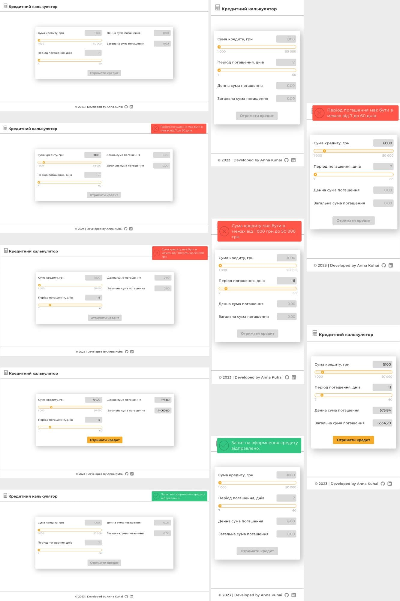

# Кредитний калькулятор

## Опис проекту

Проект створений з метою реалізації кредитного калькулятора, який дозволяє користувачам обчислити
денну та загальну суми погашення позики. Калькулятор розраховує вартість погашення на основі
введеної суми позики та періоду погашення.

---

## Виконані завдання

### Технічні

- Проєкт реалізовано з використанням чистого HTML, SASS та JavaScript (ES6).
- Виконано адаптивну верстку з трьома точками перелому:
  1. mobile: 375px;
  2. tablet: 768px;
  3. desctop: 1280px.
- Здійснено підключення шрифтів за допомогою font-face.
- Забезпечено оптимізацію розмірів векторної графіки.
- Додано відображення фавікон сторінки.

### Практичні

- Створено HTML-форму з необхідними полями та кнопкою.
- Кнопка "Отримати кредит" неактивна під час запуску калькулятора і до того, як значення у полях
  введення не пройшли валідацію.
- Користувач може вводити суму позики та період погашення як у полі введення, так і за допомогою
  слайдера (повзунка).
- Для полів введення встановлені ліміти. Якщо значення не введене або воно знаходиться поза межами
  лімітів, розрахунок не проводиться, а користувач отримує сповіщення про наявність помилки. Якщо
  значення валідні, автоматично проводиться розрахунок денної та загальної суми погашення позики
  згідно наданих формул, а користувач отримує можливість натиснути кнопку "Отримати кредит".
- Після натискання кнопки з'являється сповіщення про "Успішний запит", а форма автоматично
  очищується.

---

## Запуск проєкту

### Клонування репозиторію:

Склонуйте репозиторій проекту на своєму локальному комп'ютері. Ви можете скористатися командою git
clone, якщо ви використовуєте систему контролю версій Git.

### Запуск Live Sass Compiler:

Запустіть розширення "Live Sass Compiler" у редакторі VS Code. Це дозволить автоматично компілювати
файли SASS у CSS під час редагування.

### Запуск Live Server:

Запустіть розширення "Live Server" у редакторі VS Code, щоб запустити локальний веб-сервер. Це
дозволить переглядати та тестувати веб-сторінку на локальному сервері.

### Перегляд результатів:

Після запуску локального сервера відкрийте браузер та перейдіть за адресою, яка відображається в
консолі, для перегляду веб-сторінки у живому режимі.
